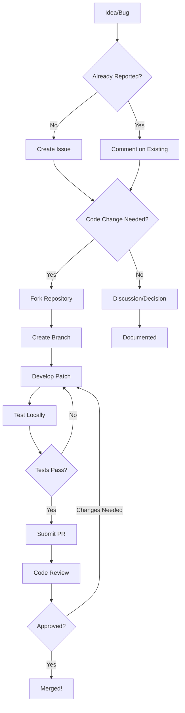

# Contributing to Cromite

Cromite welcomes contributions from the community! Whether you're reporting bugs, submitting patches, or helping with documentation, your contributions help make Cromite better for everyone.

## Project Goals

Before contributing, understand Cromite's core objectives:

<CardGroup cols={2}>
  <Card title="Privacy First" icon="shield-halved">
    Limit features that track user habits. If technically impossible to remove, disable by default and let users choose to re-enable.
  </Card>
  
  <Card title="Independence" icon="hand-sparkles">
    Reduce tight integration between browser and manufacturer. Minimize dependencies on Google services.
  </Card>
  
  <Card title="Bromite Legacy" icon="heart">
    Continue the excellent work by csagan5 with Bromite, ensuring this research and development isn't lost.
  </Card>
  
  <Card title="Collaboration" icon="users">
    Promote integration with other non-profit, open-source browsers and contribute improvements back to Chromium when mature.
  </Card>
</CardGroup>

<Warning>
  **Privacy Limitations**: Cromite's privacy features, including anti-fingerprinting mitigations (which are not comprehensive), are **not suitable for journalists or people living in countries with freedom limitations**. Please recommend [Tor Browser](https://www.torproject.org/download/) for such cases.
</Warning>

## Ways to Contribute

### 1. Reporting Issues

Found a bug or have a feature request? Submit it on GitHub!

<Steps>
  <Step title="Check Existing Issues">
    Search [GitHub Issues](https://github.com/uazo/cromite/issues) to see if your issue already exists.
  </Step>
  
  <Step title="Use Issue Templates">
    GitHub provides templates for different issue types. **Note**: Templates are not visible on mobile.
    
    Available templates:
    - **Bug Report**: For crashes, errors, or unexpected behavior
    - **Feature Request**: For new functionality
    - **Privacy/Security Issue**: For privacy or security concerns
  </Step>
  
  <Step title="Provide Details">
    Include:
    - **Cromite version**: Check Settings → About
    - **Device/OS**: Android version, device model, or OS
    - **Steps to reproduce**: Clear steps to trigger the issue
    - **Expected vs actual behavior**: What should happen vs what happens
    - **Logs/screenshots**: If applicable
  </Step>
</Steps>

<Tip>
  For Android crashes, include the logcat output. You can enable crash logging in Cromite settings.
</Tip>

### 2. Submitting Patches

Contribute code improvements, bug fixes, or new features:

<Steps>
  <Step title="Fork and Clone">
    ```bash
    git clone https://github.com/YOUR-USERNAME/cromite.git
    cd cromite
    git checkout -b my-feature-branch
    ```
  </Step>
  
  <Step title="Create Your Patch">
    Your patch should:
    - Apply cleanly to the Chromium version in `build/RELEASE` (currently **145.0.7632.120**)
    - Follow existing patch naming conventions
    - Include clear commit messages explaining the change
    - Be focused on a single improvement or fix
    
    Example patch structure:
    ```bash
    # Edit Chromium source
    cd chromium/src/
    # Make your changes...
    
    # Create patch file
    git add -u
    git commit -m "Add feature X to improve privacy"
    git format-patch -1 --stdout > ../../cromite/build/patches/Add-feature-X.patch
    ```
  </Step>
  
  <Step title="Update Patch List">
    Add your patch to `build/cromite_patches_list.txt` in the appropriate position:
    
    ```bash
    echo "Add-feature-X.patch" >> build/cromite_patches_list.txt
    ```
    
    Consider where your patch fits logically (privacy patches together, UI patches together, etc.)
  </Step>
  
  <Step title="Test Your Changes">
    Build Cromite with your patch applied:
    
    ```bash
    # Using Docker (recommended)
    docker exec -ti cromite-dev bash
    cd chromium/src/
    autoninja -C out/Default chrome_public_apk
    ```
    
    Test thoroughly:
    - Does the build complete successfully?
    - Does your feature work as expected?
    - Are there any regressions?
  </Step>
  
  <Step title="Submit Pull Request">
    ```bash
    git add build/patches/Add-feature-X.patch build/cromite_patches_list.txt
    git commit -m "Add patch: Feature X for improved privacy"
    git push origin my-feature-branch
    ```
    
    Open a pull request on GitHub with:
    - Clear title describing the change
    - Description of what the patch does
    - Why this change aligns with Cromite's goals
    - Testing performed
  </Step>
</Steps>

#### Patch Acceptance Criteria

Patches are accepted if they:

✅ **Align with project goals**: Privacy, security, or user control improvements

✅ **Are well-tested**: Don't break existing functionality

✅ **Follow conventions**: Match existing patch style and naming

✅ **Include documentation**: Comments explaining non-obvious changes

✅ **Maintain compatibility**: Work across Android, Linux, and Windows builds

❌ **Will be rejected if**:
- Add telemetry or tracking
- Increase integration with Google services
- Break core browser functionality
- Introduce security vulnerabilities

### 3. Join Discussions

For questions, ideas, or general discussion:

<Card title="GitHub Discussions" icon="message" href="https://github.com/uazo/cromite/discussions">
  Join the community discussion forum for:
  - Usage questions
  - Development discussions
  - Feature ideas
  - General feedback
</Card>

## Help Wanted

The project maintainer has identified several areas where help is especially needed:

<AccordionGroup>
  <Accordion title="Chromium Issue Tracking">
    **Problem**: Chromium closes many issues, making it hard to track which new features should be enabled or disabled in Cromite.
    
    **Needed**: A tool that scans the Chromium git log by bug ID and lists related commits.
    
    **Skills**: Git, scripting (Python/Shell), Chromium issue tracker familiarity
    
    Reference: [Chromium development mailing list discussion](https://groups.google.com/a/chromium.org/g/chromium-dev/c/FqgqyT422Sk)
  </Accordion>
  
  <Accordion title="Chrome Flags Monitoring">
    **Problem**: Chromium has hundreds of flags that change behavior. Some improve privacy, others harm it. Tracking all changes is difficult.
    
    **Needed**: A tool that:
    - Queries public Finch (Google's flag configuration) endpoints daily
    - Records flag changes over time
    - Helps identify new flags to evaluate
    
    **Skills**: API integration, data collection, web scraping
    
    Related: Help setting up UI for [bromite-flags-list](https://github.com/uazo/bromite-flags-list)
  </Accordion>
  
  <Accordion title="Blink Feature Tracking">
    **Problem**: Blink (Chromium's rendering engine) constantly adds new web platform features. Need to evaluate each for privacy/security implications.
    
    **Needed**: Automated tracking of:
    - [Mozilla's Standards Positions](https://github.com/mozilla/standards-positions/) - Firefox's stance on new features
    - [W3C TAG Design Reviews](https://github.com/w3ctag/design-reviews) - Web standards review
    - [Chrome Platform Status](https://chromestatus.com/roadmap) - Feature roadmap
    - Create similar position tracker for Cromite
    
    **Skills**: Web scraping, GitHub API, standards knowledge
  </Accordion>
  
  <Accordion title="Test Suite Development">
    **Problem**: Cromite lacks comprehensive automated tests. This is unprofessional and potentially dangerous for users.
    
    **Needed**: A complete test suite including:
    - Privacy feature tests (fingerprinting protection, etc.)
    - Security tests (sandbox, isolation, etc.)
    - Functionality tests (ensure features work)
    - Regression tests (catch breaking changes)
    - Cross-platform tests (Android, Linux, Windows)
    
    **Skills**: Test automation, Selenium/WebDriver, Chromium testing framework, CI/CD
    
    <Warning>
      This is a **critical need**. Users must know that Cromite is tested properly.
    </Warning>
  </Accordion>
  
  <Accordion title="Script Improvements">
    **Problem**: Build scripts are "haphazard and poorly documented" (maintainer's words).
    
    **Needed**: 
    - Refactor build scripts for clarity
    - Add comprehensive documentation
    - Improve error handling
    - Make scripts more maintainable
    
    **Skills**: Shell scripting, build systems, documentation
    
    See: `tools/` directory in the repository
  </Accordion>
</AccordionGroup>

<Note>
  Interested in any of these areas? Start a discussion on [GitHub Discussions](https://github.com/uazo/cromite/discussions) or check the [help wanted issues](https://github.com/uazo/cromite/labels/help%20wanted).
</Note>

## Development Resources

<CardGroup cols={2}>
  <Card title="Build Guide" icon="hammer" href="/development/building">
    Learn how to build Cromite from source
  </Card>
  
  <Card title="Patch System" icon="code-merge" href="/development/patches">
    Understand Cromite's 333 patches
  </Card>
  
  <Card title="Docker Setup" icon="docker" href="/development/docker-setup">
    Use Docker for development
  </Card>
  
  <Card title="Chromium Docs" icon="book" href="https://www.chromium.org/developers/how-tos/get-the-code">
    Official Chromium build documentation
  </Card>
</CardGroup>

## Code of Conduct

When contributing, please:

- **Be respectful**: Treat all contributors with respect
- **Be constructive**: Focus on improving the project
- **Be patient**: Maintainers are volunteers with limited time
- **Be clear**: Communicate clearly and provide context
- **Be collaborative**: Work together to find the best solutions

## Contribution Workflow



## Getting Help

Need help contributing?

<Steps>
  <Step title="Check Documentation">
    - [Build Guide](/development/building)
    - [Patch System](/development/patches)
    - [Docker Setup](/development/docker-setup)
  </Step>
  
  <Step title="Search Issues">
    Someone may have had the same question: [GitHub Issues](https://github.com/uazo/cromite/issues)
  </Step>
  
  <Step title="Ask on Discussions">
    Post your question: [GitHub Discussions](https://github.com/uazo/cromite/discussions)
  </Step>
  
  <Step title="Be Patient">
    The maintainer and community are volunteers. Responses may take time.
  </Step>
</Steps>

## Support Cromite

If you can't contribute code, consider:

### Financial Support

Support Cromite development through PayPal:

- **Current fundraising**: https://www.paypal.com/pools/c/9hEHZ6tElk

Donations help cover:
- Build server costs
- Development time
- Maintenance and testing

### Spread the Word

- Star the [GitHub repository](https://github.com/uazo/cromite)
- Share Cromite with privacy-conscious friends
- Write reviews or blog posts
- Answer questions in Discussions

## Recognition

Cromite contributors are recognized in:

- Git commit history
- Release notes (for significant contributions)
- Community discussions

All contributions, big or small, help make Cromite better! 🎉

## License

By contributing to Cromite, you agree that your contributions will be licensed under:

- **Cromite-specific code**: GNU GPL-2+
- **Patches from Bromite**: GNU GPL v3

Each patch should include appropriate license headers.

## Next Steps

Ready to contribute?

<CardGroup cols={2}>
  <Card title="View Issues" icon="bug" href="https://github.com/uazo/cromite/issues">
    Find bugs to fix or features to implement
  </Card>
  
  <Card title="Join Discussions" icon="message" href="https://github.com/uazo/cromite/discussions">
    Discuss ideas with the community
  </Card>
  
  <Card title="Build from Source" icon="hammer" href="/development/building">
    Set up your development environment
  </Card>
  
  <Card title="Help Wanted" icon="hand" href="https://github.com/uazo/cromite/blob/master/docs/HELP_ME_PLEASE.md">
    See where help is most needed
  </Card>
</CardGroup>